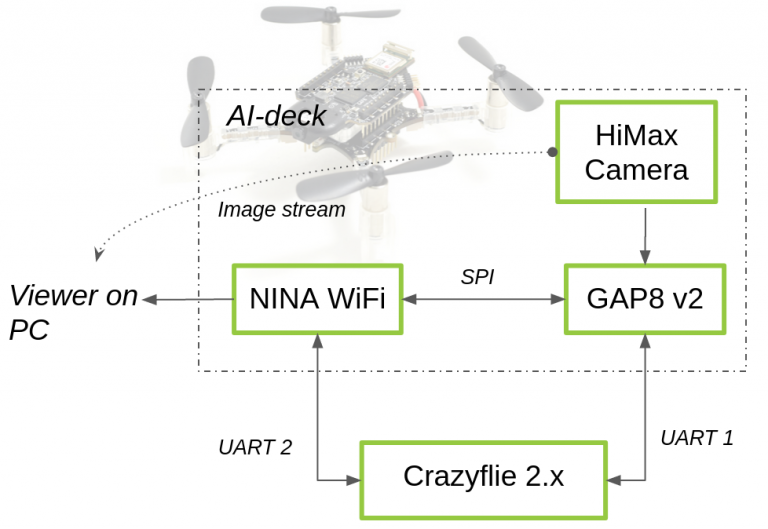

# AI-deck Communication Compatible with the Lighthouse Deck

## Overview


Both the Lighthouse and AI-Deck are connected to the Crazyflie over UART1, so they will interfere with each other.

This repository provides the ability for the Gap8 to send messages to the Crazyflie over the path `Gap8-[SPI]->NINA-[UART2]->Crazyflie` and for the Crazyflie to send messages to the Gap8 over the path `Crazyflie-[UART1]->Gap8` while the lighthouse is operating.  
The only caveat is that the lighthouse informational LED needs to be disabled if you want to send messages from the Crazyflie to the Gap8 because the Crazyflie uses UART1 tx to control the lighthouse LED.  A better solution might be to send messages from the Crazyflie to the Gap8 over the NINA as well, but the SPI functions are currently only implemented in one direction (see [this issue](https://github.com/GreenWaves-Technologies/gap_sdk/issues/223) for more information).

In the long run, the lighthouse will be on the I2C interface, so it will be compatible with the AI deck.

## Repository structure:
* **NINA**: The firmware for the NINA wifi chip
* **GAP8**: GAP8 test code for sending and receiving messages.  It will send a ping-pong message, incrementing a counter in the message with each hop.  `cf_interface.h` provides the API for sending and receiving messages
* **crazyflie_app**: Crazyflie code that is the counterpart to the GAP8 code.  `ai_deck_interface.h` provides the API for sending and receiving messages

## Disable the Lighthouse LED control code
If you want to send messages from the Crazyflie to the Gap8 while using the Lighthouse, you need to disable the LED control code. In the firmware folder, the content of the function `lighthouseCoreSetLeds` in `src/modules/src/lighthouse/lighthouse_core.c` needs to be commented out.


## Flashing the NINA firmware

To flash the NINA-chip with Docker use the following Code (mabye you have to run it with sudo).

```
docker run --rm -it -v $PWD:/module/ --device /dev/ttyUSB0 --privileged -P espidf:3.3.1 /bin/bash -c "make menuconfig; make clean; make all; /openocd-esp32/bin/openocd -f interface/jlink.cfg -f board/esp-wroom-32.cfg -c 'program_esp32 build/partitions_singleapp.bin 0x8000 verify' -c 'program_esp32 build/bootloader/bootloader.bin 0x1000 verify' -c 'program_esp32 build/main_com.bin 0x10000 verify reset exit'"
```
